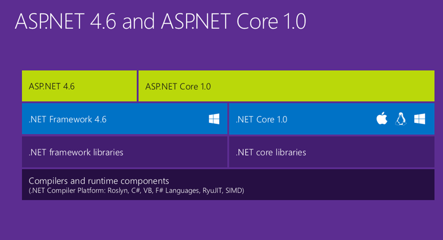

# Notas

## Net Core

* Para ir actualizando: <https://www.microsoft.com/net/download/core#/current/sdk>
  * Se migró a version: 1.1.0-preview1-005077
    * Se ejecutó comando:

```(sh)
    dotnet migrate --report-file migrate.txt
```

* Verificar que en UBUNTU seguramente se actualiza automaticamente
  * Si es así, entonces mantener sincronizados las computadoreas NB1 y SUPERVISOR

### Orden de llamada de Ejecución, al inicio del programa

1. Main
    1. new WebHostBuilder().UseStartup\<tipo\> //en esta instrucción se indica el  el type (nombre de la clase) usada para el la inicialización del WebHost (en gral la clase se llama 'StartUp')
        1. Startup (constructor)
        2. StartUp.ConfigureServices
        3. StartUp.Configure
    2. Otras instruciones
    3.host.Run()  //Ejecuta en loop infinito el sitio web  
2. End

---

## Base de datos

### Scaffoldear

#### Comando usado para generar codigo de modelo de base de datos inicial

```(sh)
dotnet ef dbContext scaffold "Data Source=...
```

#### Tareas para ir actualizando los modelos desde la DB

* Renombrar EPSS.Back.csproj  x EPSS.csproj porque el nombre el namespace lo toma el nombre del proyecto

```(sh)
mv EPSS.Back.csproj EPSS.csproj
```

* Si existe la carpeta **Models**, renombrarla a **Models.ORI**

```(sh)
mv Models/ Models.ORI
```

* 'scaffoldear' con las tablas nuevas
  * actualizar _scaffoldy.sh_
  * __*Comando*__:  

```(sh)
. ./scaffoldy.sh
```

* Comparar carpeta vieja con la nueva

```(sh)
meld Models.ORI/ Models
```

* Mergear la carpeta nueva con la vieja
  * Verificar modelos nuevos, modificados y sus relaciones
  * Verificar el archivo de contexto, y ajustar de ser necesario
* Borrar carpeta nueva

```(sh)
rm Models -R
```

* Renombrar nuevamente la carpeta donde se ejecutó el *scaffold* a su nombre original

```(sh)
mv Models.ORI/ Models
```

* Renombrar el archivo EPSS.csproj  x EPSS.Back.csproj

```(sh)
mv EPSS.csproj EPSS.Back.csproj
```

---

### Como conectar desde Linux (en realidad desde otra computadora) al Sql Server

* 1ro) Habilitar al SQLServer a recibir conexiones remotas
* 2do) Habilitar al SQLServer a recibir conexiones via TCP-IP y configurarle el port 1433
    Your SQL Server is installed as named instance, so first of all try connecting to your server using the following server name: IP Address\SQLEXPRESS.  
    When you install SQL Server as named instance it uses dynamic TCP/IP ports by default, so it is not possible to connect to it whitout specifying instance name (just IP address). If you need to connect to your server without using instance name you have to reconfigure your server to use static TCP port. To do it please perform the following:
  * open SQL Server Configuration Manager;
  * switch to the SQL Server Network Configuration | Protocols   for SQLEXPRESS;
  * double-click the TCP/IP protocol;
  * select the Yes value in the Enabled field;
  * switch to the IP Addresses tab;
  * find the IPAll section;
  * clear the TCP Dynamic Ports field in that section;
  * specify the 1433 value in the TCP Port field:

    En la cadena de conexion solo usar la direccion IP, sin especificar la instancia.
* 3ro) Habilitar el port 1433 en Firewall

>__ref:__
>
>* <https://blogs.msdn.microsoft.com/walzenbach/2010/04/14/how-to-enable-remote-connections-in-sql-server-2008/>
>
>* <http://www.solvetic.com/tutoriales/article/2657-como-abrir-o-cerrar-un-puerto-con-el-firewall-en-windows-10/>
>
>* <http://dba.stackexchange.com/questions/62165/i-cant-connect-to-my-servers-sql-database-via-an-ip-address>

* __Otros:__
  * Cadenas de conexiones usadas  
    * Local NB01
      * @"Data Source=NB01\SQLEXPRESS;Integrated Security=True;Connect Timeout=15;Encrypt=False;TrustServerCertificate=True;ApplicationIntent=ReadWrite;MultiSubnetFailover=False;Database=escuelapsdelsur;"
    * Desde Linux hacia NB01
      * @"Data Source=192.168.1.41;Connect Timeout=15;Encrypt=False;ApplicationIntent=ReadWrite;MultiSubnetFailover=False;Database=escuelapsdelsur;User Id=sa;Password=sasasasa;";

  * Como Monitorear si el sqlserver abre el port y está habilitado  
    * Abrir el Monitor de recursos
    * Solapa: Red
      * Seccion: Puertos de escucha
        * Buscar proceso: sqlservr.exe
        * Debe verse:
          * Proceso: sqlservr.exe
          * PID: [indistinto]
          * Direccion: IPv4 sin especificar
          * Port: 1433
          * Protocolo: TCP
          * Estado de Firewall: Permitido, no restringido

---

### Entornos / Environment

> ref: <https://docs.microsoft.com/en-us/aspnet/core/fundamentals/environments>

* Windows DOS

```(dos)
set ASPNETCORE_ENVIRONMENT=Development
```

* Windows PowerShell

```(powershell)
$Env:ASPNETCORE_ENVIRONMENT = "Development"
```

* Linux

```(sh)
export ASPNETCORE_ENVIRONMENT=Development
```

---

### Script de DB (SQLCMD)

> ref: <https://technet.microsoft.com/es-es/library/ms165702(v=sql.105).aspx>

---

### .NET Core vs ASP.NET Core

Básicamente NET Core es el framework base para cualquier aplicación '.NET Core', que es multiplataforma.
ASP.NET Core son librerías adicionales que permite crear aplicaciones tipo ASP.NET pero usando el framework '.NET Core' a diferencia de usar el '.NET framework' (tradicional) que solo se ejecuta en windows.


> ref: [Diagrama gral de Frameworks](<https://www.hanselman.com/blog/ASPNET5IsDeadIntroducingASPNETCore10AndNETCore10.aspx>)

---

## Commit conventions

* **feat**: A new feature
* **fix**: A bug fix
* **docs**: Documentation only changes
* **style**: Changes that do not affect the meaning of the code (white-space, formatting, missing semi-colons, etc)
* **refactor**: A code change that neither fixes a bug or adds a feature
* **perf**: A code change that improves performance
* **test**: Adding missing tests
* **chore**: Changes to the build process or auxiliary tools and libraries such as documentation generation

> ref: <https://gist.github.com/brianclements/841ea7bffdb01346392c>
